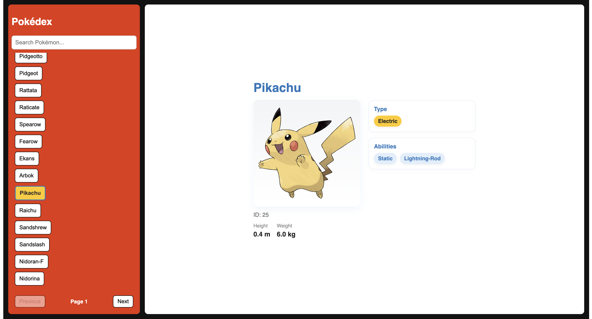

# Pokédex

A Pokédex web application built with React and TypeScript that allows users to browse, search, and explore Pokémon using data from PokéAPI.

The application displays Pokémon in pages of 30 and retrieves detailed information for each selected Pokémon through separate API requests.

## Preview



## Features

- Browse Pokémon in pages of 30
- Navigate between pages using Previous and Next controls
- Search Pokémon within the current page
- Select a Pokémon to view detailed information
- View official artwork, ID, height, weight, types, and abilities
- Loading and error states for API requests and images
- Responsive layout for desktop and smaller screens

## Tech Stack

- React
- TypeScript
- JavaScript
- CSS
- Fetch API
- PokéAPI

## How It Works

The application uses two types of requests to PokéAPI:

1. A list request retrieves Pokémon in pages of 30.
2. When a Pokémon is selected, a second request retrieves its detailed information.

The fetched data and UI state are managed through a custom `usePokedex` hook, while API requests are organized in a dedicated service.

## Project Structure

```text
src/
├── components/     UI components
├── hooks/          Pokédex state and behavior
├── services/       PokéAPI requests
├── styles/         Component and layout styles
├── types/          TypeScript types
└── App.tsx
```

## Getting Started

### Requirements

Tested on:

- macOS / Linux
- Node.js
- npm

### Install dependencies

From the repository root:

```sh
npm install
```

### Run the application

```sh
npm start
```

The application will be available at:

`http://localhost:3000`

## API

Pokémon data is provided by [PokéAPI](https://pokeapi.co/).

